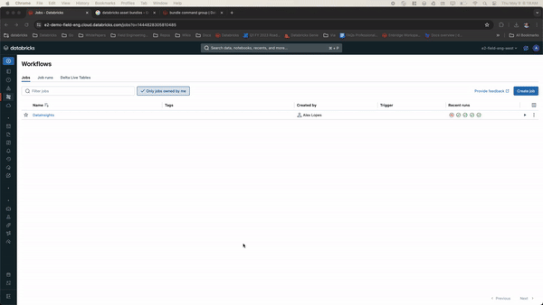

## Introduction
The goal of this project is to provide a tool to facilitate the creation of streaming pipelines according to the details and paremeters defined in a yaml 
configuration file.  

### Features
You can specify multiple pipelines in a single configuration file. It exposes all the streaming configurations as yaml configuration, enabling the creation of streaming pipelines with no code changes.

* Integration with databricks asset  bundles allow you to quickly deploy streaming pipelines in a new environment
* Jinja2 supported in the configuration files it allows your config files to inherit config from templates with the definition of the most of the parameters and then it only requires to fill in specific parameters
* Dynamic config file, allow the creation of parameter files that can be used to dynamically generates pipeline config enabling the creation of config files at scale 
* Lightwheight and simple to change it can be easily customized for a variety of use cases
* Configurable support to append only and CDC type 1 silver tables

### Bronze Layer
You can also specify write_options, output_mode, and trigger for the output writeStream object
that is used to write the data (land it) in a bronze Delta table. 
 You can also define the transformations you would like to apply to the previously generated 
bronze table in a silver pipeline. 

### Silver Layer
The silver layer is a pipelines that starts from the assumption we will be reading from a bronze tables if you have defined a bronze table the pipeline will handle that automatically 

In this silver pipeline you also have the flexibility to define the read_options and write_options to read raw data from a 
bronze Delta table and stream it to a silver Delta table. 
 The silver pipeline allows you to apply a schema to the raw data, parse nested columns and do some 
basic transformations such as renaming column names. 
 The silver pipeline also supports/handles CDC if specified in the config file. It contains upsert logic for 
the Delta table using the Delta merge operation required when CDC is enabled. 

### How to use this framework:
  1. Fill in a pipeline configuration file (.yml). To look at an example configuration file please refer to the example file `pipeline_config.yml`.
  2. Run the Raw Streaming notebook. This will build the stream objects to read from your specified input source and land the data in a Bronze Delta table. Make sure to update the config_path variable.
  3. Run the Silver Streaming notebook. This will read the raw data from the previously defined bronze Delta table, unpack nested columns, apply basic transformations such as renaming columns and write the data to a Silver Delta table. Make sure to update the config_path variable.

## Testing
In the aux folder you can find the DataGenerator Notebook this notebook allows for artificial generated CDC data that can be used to test the framework and configurations. 
WHile testing make sure you update the pipeline_config.yaml file accordingly to ensure it points to the right source data

## Additional resources

* [Streaming Documentation](https://docs.databricks.com/en/structured-streaming/index.html)
* [Jinja Template Design DOC](https://jinja.palletsprojects.com/en/3.1.x/templates/)